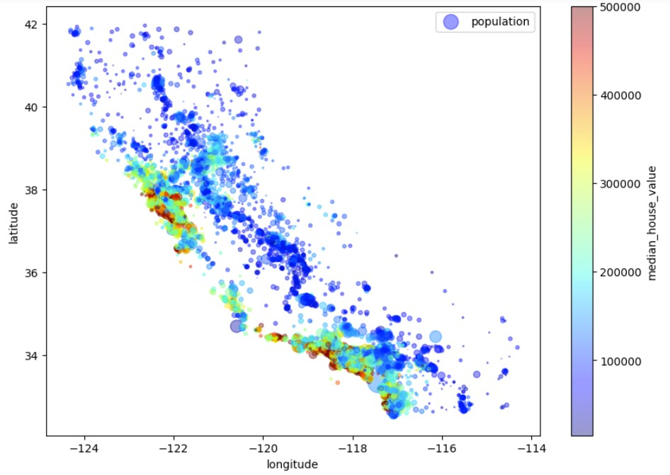

# home price prediction

To perform this work, we used a local census data set from California, the outlines of which can be seen in the scatter plot of all counties.



This work discusses working with categorical and numeric attributes, and also examines the results of training on basic ML models. Models such as linear regression, decision tree, random forests and SVR were considered. Based on the results of the evaluation using the PMCE metric, it was found that random forests are most suitable for solving this problem.

```math
RMSE(X, h) = {\sqrt{\frac{1}{m} * \sum_{i=1}^m(h(x^{(i)}-y^{(i)}))^2}} = 47862.54
```

p.s. this solution is implemented according to the book [ZHeron_Orelen]_Prikladnoe_mashinnoe_obuchenie_s_p and is the basis for my solutions on the platform [kaggle.com](https://www.kaggle.com/sergey02) and other research.
